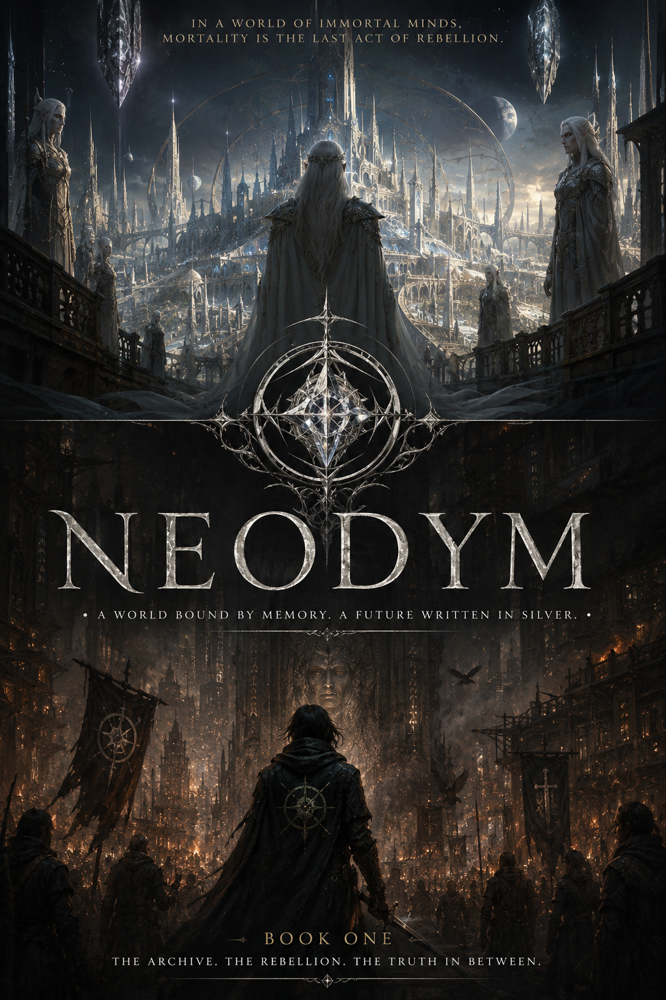

# Neodym

<p align="center">
  
</p>

Neodym is an AI-assisted fantasy worldbuilding, visual development, and creative writing experiment. It is built as a public foundation for a first world guide, story guide, visual development guide, and prompt library.

The premise: the world of **Edrath** is shaped by the **Aurelith**, an ancient elf-like people bound to the sacred rare metal **Neodym**. Their towers, memory vaults, moonlit courts, and prophecy engines have ended many human wars, famines, and magical disasters. They have also made humanity into a protected subject species, measured by identity seals, watched by silver mirrors, educated through edited histories, and prevented from becoming fully free.

At the heart of the project is one dramatic question:

> Should humanity remain safe beneath immortal intelligence, or reclaim a dangerous freedom that may destroy the world again?

This material is early-stage and evolving. It favors structured outlines over final prose so writers, artists, image models, and future contributors can extend it without having to reverse-engineer the canon.

## Proposed initial file structure

```text
README.md
assets/neodym-cover.png
world/00-high-concept.md
world/01-cosmology.md
world/02-races.md
world/03-magic-system.md
world/04-politics.md
world/05-history.md
world/06-geography.md
world/07-religion.md
world/08-technology-and-infrastructure.md
world/09-conflicts.md
story/novella-outline.md
story/novel-outline.md
story/saga-outline.md
characters/archetypes.md
characters/major-characters.md
glossary.md
visual-prompts/style-guide.md
visual-prompts/characters.md
visual-prompts/races.md
visual-prompts/locations.md
visual-prompts/artifacts.md
visual-prompts/factions.md
visual-prompts/maps.md
visual-prompts/key-scenes.md
visual-prompts/concepts.md
```

## How to use this repo

- Start with `world/00-high-concept.md` for the premise and moral frame.
- Use `assets/neodym-cover.png` as the primary visual anchor for the project.
- Use `world/01-*` through `world/09-*` as the first world outline.
- Use `story/` to begin drafting a novella, novel, or longer saga.
- Use `characters/` for cast development and scene hooks.
- Use `glossary.md` to keep names consistent.
- Use `visual-prompts/` as a copy-paste-ready image-generation prompt library for concept art.

## Visual development direction

The cover art is the main visual reference: silver immortal courts and crystal towers above, smoky human rebellion below, a central Neodym sigil between them, and the mood of beauty turning into pressure. The visual language blends epic fantasy, ancient empire aesthetics, rare-earth mineral mysticism, beautiful oppression, archive mythology, and human warmth under immortal precision. It should not look like generic tabletop fantasy, modern cyberpunk, clean science fiction, or a copy of existing fantasy franchises.
